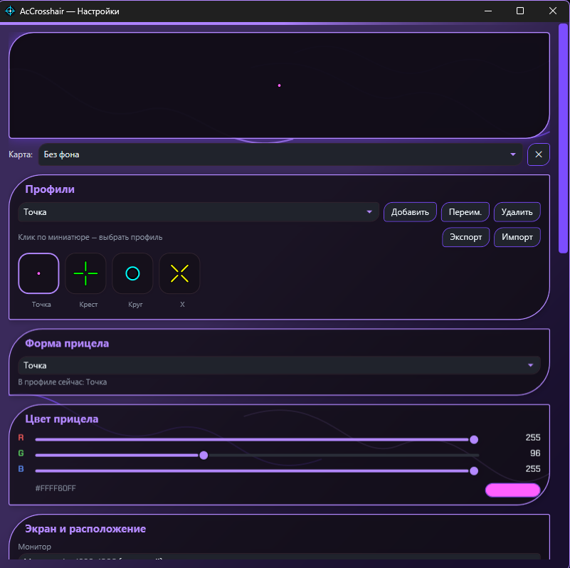
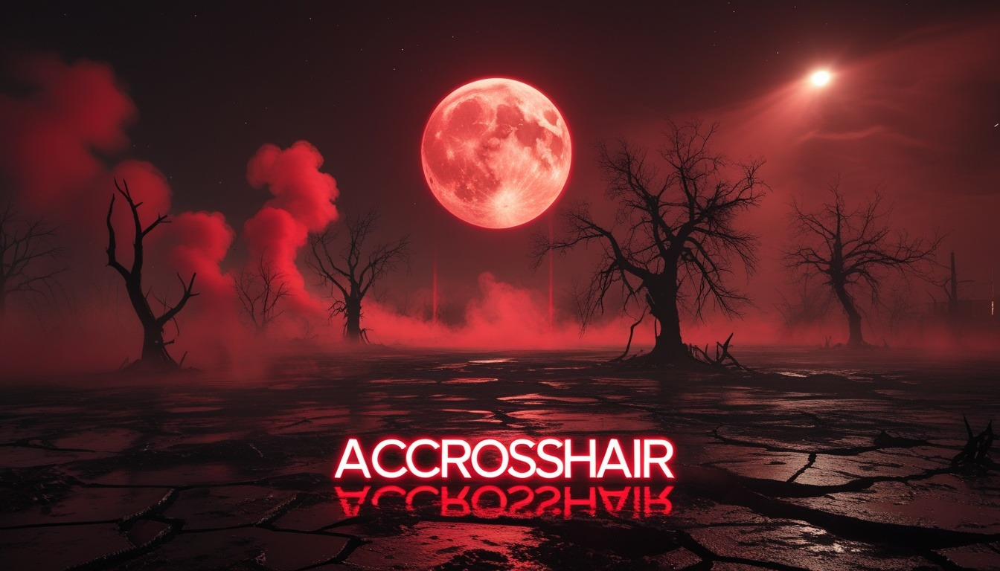

# AcCrosshair

Прицел (crosshair) поверх экрана для Windows — оверлей поверх любых окон и игр, с гибкой настройкой формы, цвета и размера, профилями и горячими клавишами.

## Возможности

- Прицел рисуется поверх всех окон (в том числе игр в оконном/безрамочном режиме) и не мешает кликам мышью (click-through).
- Несколько сохранённых профилей прицела — форма, цвет, размер, толщина, зазор, точка в центре, обводка.
- Выбор монитора, на котором рисуется прицел, и смещение от центра экрана по X/Y.
- Полностью переназначаемые горячие клавиши прямо в окне настроек, без правки файлов.
- Экспорт/импорт профилей в JSON-файл — перенести настройку на другой ПК или поделиться ей.
- Автозапуск вместе с Windows (без прав администратора).
- Тема оформления «Токсичный газ»: асимметричные «мембранные» карточки, фирменный шрифт Chakra Petch, 11 цветовых вариантов акцента — цвет применяется сразу ко всему приложению, включая иконку в трее.
- Интерфейс на русском и английском.

## Что нового в v2

Полный визуальный редизайн приложения в теме **«Токсичный газ»**, а также несколько практических доработок поверх него:

- Единое оформление во всём приложении — окно настроек, диалоги, всплывающие уведомления и меню в трее выдержаны в одном акцентном цвете через общий `ResourceDictionary` (`Themes/ToxicGas.xaml`).
- Асимметричные «мембранные» карточки и элементы интерфейса вместо стандартных прямоугольных панелей.
- Фирменный шрифт Chakra Petch, встроенный прямо в сборку (не требует установки на компьютере пользователя).
- Органичные декоративные линии («жилки») и сплошная цветовая подложка на фоне окна настроек.
- 11 цветовых вариантов темы на выбор в разделе «Оформление» — цвет применяется сразу ко всему интерфейсу, включая иконку в трее (она перекрашивается под акцент на лету).
- Плавное появление/исчезание прицела при переключении видимости — вместо мгновенного щелчка.
- Хоткей «Быстрый предпросмотр» — показывает прицел на пару секунд поверх любого окна, даже если он выключен, не открывая настройки.
- Если хоткей не удалось назначить (конфликт с другой программой), это теперь видно в подсказке иконки трея и во всплывающем уведомлении, а не только в открытом окне настроек.
- Автозапуск с Windows и экспорт/импорт профилей — см. разделы ниже.
- Новые иконка приложения и заставка при запуске — в едином стиле «Токсичный газ» вместо прежних, оставшихся от голубой темы.

## Требования

- Windows 10/11
- .NET 10 SDK (для сборки): https://dotnet.microsoft.com/download

## запуск

`AcCrosshair.exe` полностью самодостаточен, его можно переносить на другой ПК одним файлом.

Должен быть установлен .NET 10 Desktop Runtime (https://dotnet.microsoft.com/download/dotnet/10.0) — сам exe
рантайм в себе не несёт.

**Перед запуском новой версии закройте запущенное приложение** (иконка в трее → Выход)

## Использование

После запуска приложение сворачивается в трей (иконка рядом с часами, окрашенная под текущий акцент темы). Сам прицел рисуется поверх всех окон в центре основного экрана и не мешает кликам мышью.

Правой кнопкой по иконке в трее:
- **Показать/скрыть прицел** — вкл/выкл оверлей (с плавной анимацией)
- **Следующий профиль** — переключение между сохранёнными прицелами
- **Настройки...** — окно настройки формы, цвета, размера, толщины, зазора и профилей
- **Выход**

Если подсказка иконки трея показывает предупреждение (⚠) — значит, один из хоткеев не удалось назначить (комбинация уже занята другой программой). Откройте настройки → «Хоткеи» и назначьте другую.

## Горячие клавиши

Переназначаются в разделе «Хоткеи» окна настроек — нажмите «Записать» у нужного действия и введите комбинацию (например, `Ctrl+Shift+F6`), `Esc` отменяет запись. Либо правьте напрямую в `settings.json`.

По умолчанию:
- `F6` — показать/скрыть прицел
- `F7` — следующий профиль
- Открыть/закрыть настройки — не назначен
- Быстрый предпросмотр — не назначен (показывает прицел на несколько секунд поверх любого окна, даже если он сейчас выключен, и сам возвращает прежнее состояние)

## Профили

В окне настроек можно добавлять, переименовывать и удалять профили прицела. Каждый профиль хранит:
- форму (крест, точка, круг, крест+точка, плюс без зазора и другие)
- цвет в формате `#AARRGGBB`
- размер, толщину линий, зазор от центра
- наличие точки в центре и толщину чёрной обводки

Настройки сохраняются в `settings.json` рядом с exe-файлом (в той же папке, где лежит `AcCrosshair.exe`) и подхватываются при следующем запуске — так профиль переносится вместе с папкой программы.

### Экспорт/импорт

В разделе «Профили» кнопки «Экспорт»/«Импорт» сохраняют или загружают весь набор профилей как JSON-файл — удобно, чтобы поделиться своей настройкой с другом или перенести её на другой ПК без переноса всего `settings.json`.

## Автозапуск

В разделе «Система» окна настроек есть галочка «Запускать вместе с Windows» — добавляет или убирает ключ в `HKEY_CURRENT_USER\...\Run`, прав администратора не требует.

## Известные ограничения

- В некоторых играх с эксклюзивным полноэкранным режимом (не windowed/borderless) оверлей поверх игры может не отображаться — переключите игру в оконный или безрамочный оконный режим.

## Автор

Разработано **[Accapura](https://github.com/Accapura)**.

Нашли баг или есть идея для новой функции — открывайте [Issues](https://github.com/Accapura/AcCrosshair/issues) в репозитории.
